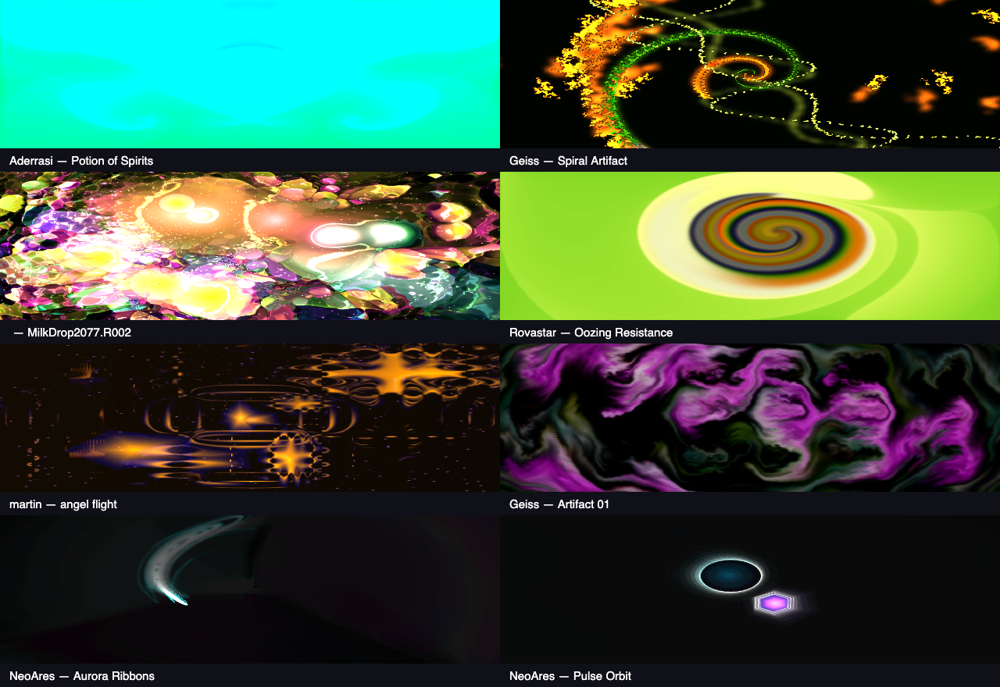
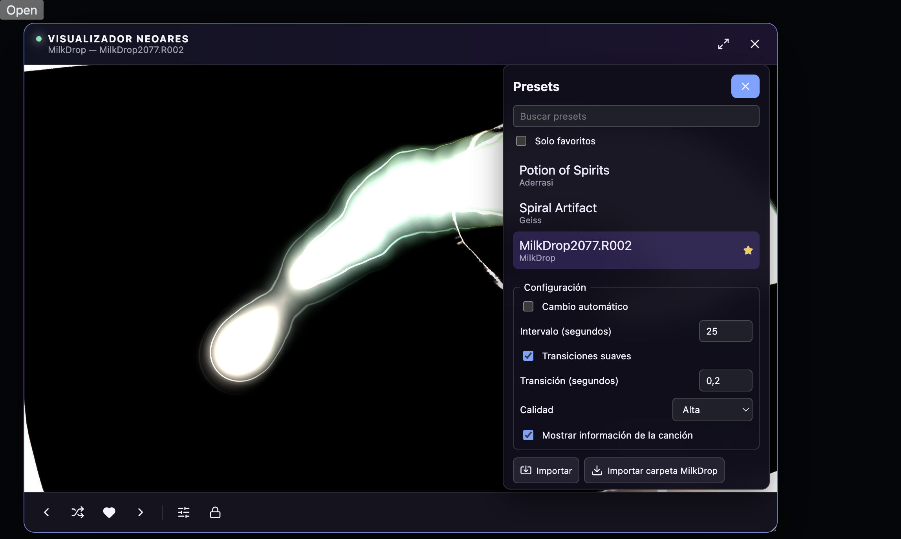

# Visualizer verification — 2026-10-09

Branch: `feature/visualizer`. Tested locally on macOS arm64 using Electron
44.4.3. This report distinguishes implemented behavior from unverified release
gates. It is not a claim of equivalence to every Winamp/MilkDrop preset or plugin.

## Reproducible checks

```sh
pnpm check
pnpm verify:visualizer
pnpm verify:visualizer-ui
```

The Electron probes start their own Vite server on port 5174 with HMR disabled,
create temporary user-data directories, and never open the real DJ library.
Synthetic audio is muted at the BrowserWindow output, not at the mixer tap.
The UI probe briefly shows a test window to exercise native fullscreen and
hide/show. Both probes close their windows and server when finished.

Latest results:

- TypeScript, 100 unit tests in 24 files, and the production build passed.
- Engine probe passed: eight presets compiled and rendered with no runtime
  errors, nonblack output, and pairwise-distinct sampled images.
- The same engine instance renders each preset, including blended transitions.
- Butterchurn's actual signed PCM RMS averaged **0.143567** with test audio and
  **0** after master mute. All eight presets also consumed silence after mute.
- Frequency measurements identified Deck A's 80 Hz signal and Deck B's 1000 Hz
  signal after a real `DualDeckMixer.crossfade()`; no deck-specific analysis
  routing is used.
- UI probe passed: favorites persisted without reloading the preset; lock did
  not prevent manual navigation; previous returned actual history; quality
  resized without rebuilding audio or engine; paused rendering stayed within
  its 15 FPS budget; fullscreen and native Escape preserved the panel.
- Renderer reconstruction reused the same audio tap. Native hide stopped
  frame rendering, show resumed it, and closing/reopening released and created
  one tap per window lifecycle.

Captures are from the running renderer, not generated mockups:





Raw PCM, band measurements and thumbnail samples:
`docs/visualizer-verification/result.json`.

## Confirmed defects corrected

1. CSP blocked WASM, while asynchronous preset failures were ignored. The motor
   therefore retained its internal/default visualization. WASM is explicitly
   allowed; dynamic JavaScript evaluation remains blocked.
2. Imported `.milk` files were passed to the converter as an already-parsed
   object. This silently discarded their equations. Conversion now receives
   raw source, preserves EEL, and uses only WASM playback. Existing managed
   imports are repaired from their preserved originals on first load.
3. Preset, favorite and quality changes recreated the engine and tap, losing
   feedback and transitions. Lifecycle and configuration changes are separated.
4. Tap release did not remove its incoming master connection; renderer disposal
   did not release the internal GL context. Both now have targeted cleanup.
5. Context-loss listeners were attached to the 2D output canvas instead of the
   internal WebGL surface. They now observe the actual rendering surface.
6. Two packaged presets (`astral projection`, `alien fish pond`) trapped during
   WASM execution. They are excluded from the curated set, rather than silently
   displayed as the previous preset. Six tested MilkDrop presets and two
   NeoAres-authored GPU presets form the current eight-preset library.
7. Electron's audio background-throttling policy can mask Page Visibility.
   A boolean native-window lifecycle event now suspends visual work without
   changing transport timing or sending PCM/FFT over IPC.

## Not yet verified

- Packaged Windows x64 and macOS Universal runtime/GPU behavior. Production
  bundling on macOS does not close these release gates.
- A prolonged listening/visual review using the user's real music collection,
  including subjective synchronization, comfort and preset preferences.
- Broad compatibility across arbitrary third-party `.milk` libraries. Import,
  conversion, duplicate handling, retry, removal and malformed input have unit
  coverage; the native file/folder dialogs have not been manually exercised here.
- A real GPU/device-reset event. Event forwarding and renderer-only restoration
  are tested separately; that is not the same as hardware fault recovery.

These limitations must remain explicit before declaring all release gates in
`contracts/VISUALIZER.md` closed.
